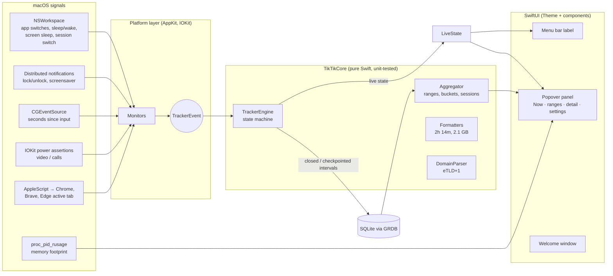

# TikTik: Architecture and Implementation Plan

**Status:** Proposed (Phase 4), awaiting approval. Nothing is built until this is approved.
**Inputs:** [SPEC.md](SPEC.md) (approved) · [design system](design/design-system.html) and [final screens](design/tiktik-design.html) (approved)

---

## 1. Architecture at a glance



**The key idea:** all the tricky logic lives in **`TikTikCore`**, a module that imports only Foundation and has no AppKit dependency. It holds:
- idle backdating
- the "frontmost app holds a display-sleep assertion" rule
- Away handling
- midnight splitting
- the stretch/session rule
- range clipping and bucketing
- formatting

The macOS layer is thin. It turns system signals into simple `TrackerEvent` values (`appActivated`, `inputIdleFor(seconds)`, `locked`, `displaySlept`, `domainChanged` and so on) and feeds them to the engine. So the logic can be unit-tested with scripted event timelines, and bugs in "what counts as Idle" are caught by tests rather than by you noticing wrong numbers.

---

## 2. Key technical decisions

| # | Decision | Choice | Why |
|---|---|---|---|
| 1 | **Menu bar host** | `NSStatusItem` + a custom **non-activating `NSPanel`** hosting SwiftUI (not SwiftUI `MenuBarExtra`) | A non-activating panel **doesn't make TikTik the frontmost app**, so "Now" and tracking keep seeing your real app. It also gives exact control of the shadcn look (no system arrow or material), clean open/close events (to start and stop RAM sampling and the 1 s timer), and closing when you click outside. `MenuBarExtra` on macOS 14 has no reliable open/close callback and activates the app. |
| 2 | **Menu bar label** | SwiftUI view rendered into the status item, redrawn **at most once a minute** (or on a state change) | Supports all six styles plus the paused countdown. Rendering is about 1 ms. |
| 3 | **Concurrency** | Engine and monitors on the **main actor** (events arrive there anyway). GRDB `DatabasePool` (WAL): writes on its serial writer, UI reads concurrent off the main thread. | Simple and race-free. Heavy queries such as 6M aggregation never block the UI. |
| 4 | **Persistence** | GRDB **6.x** (`from: "6.29.0"`), schema as in SPEC 4.1, versioned migrations | GRDB 6 builds with Swift 5.9+, so it works with the Command Line Tools on any macOS 14. GRDB 7 needs Swift 6. |
| 5 | **Crash safety** | The open interval is upserted every 60 s (`checkpoint`); on launch, an unclosed interval is closed at its last checkpoint | A crash or force-quit loses at most a minute. |
| 6 | **Domain → registrable domain** | Bundle Mozilla's **Public Suffix List** (about 230 KB text), parsed lazily into a `Set` the first time a domain is seen | Correct for `co.uk`, `github.io` and similar; no network needed. Costs about 1–2 MB RAM, only once Chrome tracking is used. |
| 7 | **Browser access** | `NSAppleScript`, compiled once per browser and run every 5 s **only while that browser is frontmost**. Reads `URL` and `mode` (incognito) of the front window's active tab. | Minimal CPU. Each run takes a few ms. |
| 8 | **Display-sleep assertion check** | `IOPMCopyAssertionsByProcess`, filtered to the frontmost PID's `PreventUserIdleDisplaySleep` assertions. Checked only when input has been idle long enough to matter. | It runs about once per idle check, not continuously. |
| 9 | **Per-app RAM** | `proc_listallpids` + `proc_pid_rusage(RUSAGE_INFO_V4).ri_phys_footprint`, with helpers summed into their app by **walking parent PIDs**, plus **responsible-PID** grouping for XPC helpers. Every 5 s, **only while the popover is open.** | Matches Activity Monitor's "Memory" column. About 1–3 ms per pass. |
| 10 | **Fonts** | JetBrains Mono TTF files (Regular, Medium, SemiBold) bundled in `Resources/Fonts`, registered at launch with `CTFontManagerRegisterFontsForURL` (process scope) | No install step for you. |
| 11 | **Theme** | `Theme.swift`: tokens as static `Color` pairs resolved through the current `ColorScheme` (via an `Environment` value), plus `Space`, `Radius` and `TextStyle` enums matching SPEC 5.1 exactly | Components can't use raw colors or sizes, only tokens. |
| 12 | **Charts** | **Swift Charts** (`BarMark`) styled with tokens: dashed `border` gridlines, minimal axes, 3 pt rounded tops, and an `chartOverlay` hover tooltip | Native and light. The Ring is a custom `Shape` (three `trim` arcs). |
| 13 | **Settings storage** | `UserDefaults` wrapped in a typed `Preferences` (`@Observable`) | Simple; observable by the UI. |
| 14 | **Launch at login** | `SMAppService.mainApp` | macOS 13+ API. Requires the app to live in `~/Applications`, which `run.sh` handles. |
| 15 | **Sample-data mode** | `TikTik --sample-data` launches with an in-memory database seeded with the mockup data | Lets us compare the real UI to the mockups pixel for pixel, and lets you preview without waiting for real data. |
| 16 | **Logging** | `os.Logger` (subsystem `app.tiktik`), viewable in Console.app | Zero cost when not viewed; helps us debug on your Mac. |

---

## 3. File structure

```
mac-app-tracker/
├── Package.swift                  # SwiftPM: TikTikCore (library), TikTik (executable), tests
├── run.sh                         # build → bundle TikTik.app → sign ad-hoc → install → launch
├── README.md                      # how to install, run, update, troubleshoot
├── SPEC.md · PLAN.md
├── design/                        # approved design references + screenshots
├── Support/
│   └── Info.plist                 # LSUIElement, bundle id app.tiktik, NSAppleEventsUsageDescription
├── Sources/
│   ├── TikTikCore/                # Foundation only. All the logic, fully unit-tested.
│   │   ├── Model/                 # ActivityState, Interval, AppIdentity, Stretch
│   │   ├── Engine/
│   │   │   ├── TrackerEvent.swift
│   │   │   ├── TrackerEngine.swift      # state machine: events → intervals
│   │   │   ├── IdlePolicy.swift         # threshold, backdating, assertion rule
│   │   │   └── MidnightSplitter.swift
│   │   ├── Query/
│   │   │   ├── TimeRange.swift          # Now, 6h … 6M (rolling windows)
│   │   │   ├── Aggregator.swift         # totals, per-app, buckets, sessions, top domains
│   │   │   └── Bucketing.swift          # 15m / 30m / 1h / day / week
│   │   ├── Domains/
│   │   │   ├── PublicSuffixList.swift
│   │   │   └── DomainParser.swift
│   │   └── Format/
│   │       ├── DurationFormatter.swift  # 2h 14m, 6h 06m, <1m, 47m 12s
│   │       └── MemoryFormatter.swift    # 612 MB, 2.1 GB
│   └── TikTik/                    # macOS app
│       ├── App/
│       │   ├── TikTikApp.swift          # @main, app delegate wiring
│       │   ├── StatusItemController.swift
│       │   ├── PopoverPanel.swift       # non-activating NSPanel + positioning
│       │   └── AppEnvironment.swift     # dependency container
│       ├── Platform/
│       │   ├── FrontmostAppMonitor.swift
│       │   ├── InputIdleMonitor.swift   # adaptive timer
│       │   ├── PowerAssertionProbe.swift
│       │   ├── SessionMonitor.swift     # lock, sleep, display, screensaver, user switch
│       │   ├── BrowserTabProbe.swift    # AppleScript for Chromium browsers
│       │   ├── MemorySampler.swift
│       │   ├── AppIconCache.swift
│       │   └── LoginItem.swift
│       ├── Storage/
│       │   ├── Database.swift           # GRDB pool, migrations
│       │   ├── IntervalStore.swift      # write, checkpoint, queries
│       │   ├── Retention.swift          # 182-day cleanup, launch + daily
│       │   └── CSVExporter.swift
│       ├── State/
│       │   ├── Tracker.swift            # owns engine + monitors, publishes LiveState
│       │   ├── Preferences.swift
│       │   └── PopoverModel.swift       # selected tab, sort, navigation
│       ├── Theme/
│       │   ├── Theme.swift              # colors, Space, Radius, TextStyle
│       │   └── Fonts.swift
│       ├── Components/                  # shadcn-style, token-only
│       │   ├── TKCard.swift · TKTabs.swift · TKButton.swift · TKBadge.swift
│       │   ├── TKProgress.swift · TKSeparator.swift · TKTooltip.swift
│       │   ├── TKSwitch.swift · TKSelect.swift · TKBanner.swift
│       │   ├── TKRing.swift · TKBarChart.swift · TKEmptyState.swift
│       │   └── AppTable.swift           # App · Time · RAM · % with sortable header
│       ├── Features/
│       │   ├── PopoverRoot.swift        # header, tabs, navigation stack, footer
│       │   ├── Now/NowView.swift
│       │   ├── Range/RangeView.swift    # ring or legend+chart, app table
│       │   ├── Detail/AppDetailView.swift
│       │   ├── Settings/SettingsView.swift · ExcludedAppsView.swift · ExportSheet.swift
│       │   ├── Welcome/WelcomeWindow.swift
│       │   └── MenuBar/MenuBarLabel.swift
│       ├── Debug/SampleData.swift       # --sample-data
│       └── Resources/
│           ├── Fonts/JetBrainsMono-{Regular,Medium,SemiBold}.ttf
│           └── public_suffix_list.dat
└── Tests/
    └── TikTikCoreTests/                 # engine timelines, idle, midnight, ranges, formatting, PSL
```

The `TK` prefix keeps our components from clashing with SwiftUI names (`Button`, `Tabs`).

---

## 4. Milestones

Each milestone ends with a **check-in**: I push the work, you run `git pull && ./run.sh` on your Mac and try the listed things, then tell me what you see. I don't start the next milestone until you're happy with the current one.

| # | Milestone | What gets built | What you check |
|---|---|---|---|
| **M0** | **Skeleton runs on your Mac** | `Package.swift`, `run.sh`, `Info.plist`, an empty `TikTikCore`, fonts registered, hourglass in the menu bar, an empty 380 × 560 panel that opens and closes, README install steps | `xcode-select --install` and `./run.sh` work. The hourglass appears, there's no Dock icon, the panel opens under the icon and closes when you click elsewhere. Also: paste me the output of `swift --version`. |
| **M1** | **Design system in SwiftUI** | `Theme.swift`, all `TK*` components, `--sample-data` rendering **every approved screen** with mockup data: Now, all ranges, detail, settings, paused, empty states, welcome, all six menu bar styles | Side by side with the mockups, in light and dark. This is the visual sign-off before any real data exists. |
| **M2** | **Tracking engine** | `TikTikCore` engine + unit tests: idle backdating, video/call rule, Away rules, midnight split, stretch rule. Platform monitors, database, checkpointing. A temporary debug line in the panel shows the live state. | Use the Mac normally for a while. Lock, sleep, play a video, sit idle, cross a midnight if convenient. The debug line and `./run.sh --dump` (prints today's intervals) look right. |
| **M3** | **Real data in the popover** | Range queries and bucketing, ring and legend+chart, `AppTable` with live RAM, sorting, bold heavy apps, chart tooltips, default tab (6h) | Every range shows plausible numbers. RAM matches Activity Monitor within reason. Sorting works. |
| **M4** | **Now tab + app detail** | Live stretch timer, recent list, app detail (usage chart, sessions, longest, first/last, RAM) | Now follows you as you switch apps (never shows TikTik). Detail numbers agree with the list. |
| **M5** | **Chrome domains** | Public Suffix List, AppleScript probe for Chrome/Brave/Edge, incognito → "Private browsing", top domains in detail, the access-denied state | The Automation prompt appears once. Sites show up as registrable domains. Incognito is hidden. Denying access shows the "No access" card. |
| **M6** | **Settings, welcome, menu bar, pause** | Settings page (every row), welcome window, launch at login, the six menu bar styles + daily goal, pause menu + banner + countdown, excluded apps | Fresh-install flow (I'll give you a reset command). Each setting takes effect. Pause and resume work. Excluded apps aren't recorded. |
| **M7** | **Data management** | 182-day retention (launch + daily), CSV export (raw / daily, range), Clear all data, empty and partial-history states | Export opens correctly in Numbers or Excel. Clear all works. Empty states appear when expected. |
| **M8** | **Performance + polish** | Verify the budget (SPEC 6) on your Mac, fix anything over budget, accessibility labels, final README | Activity Monitor: about 0% CPU idle, RAM under budget, Energy "Low". Final sign-off. |

**Order rationale:**
- **M0 first:** it proves the build toolchain on your Mac before anything else.
- **M1 before tracking:** you sign off the visuals while they're cheap to change.
- **M2 before any real-data UI:** the engine is the riskiest logic, so it gets tests before the UI depends on it.

---

## 5. Testing strategy

- **Unit tests (`TikTikCore`):** scripted timelines such as "Xcode 13:00, input stops 13:10, idle threshold 5 min, Chrome 13:20" assert the exact intervals produced. Covered:
  - idle backdating
  - display-sleep assertions
  - lock and sleep
  - midnight and DST splits
  - stretch boundaries
  - range clipping
  - bucketing
  - formatting
  - PSL edge cases (`co.uk`, `github.io`, IPs, `localhost`)

  You run them with `./run.sh test`; I'll ask for the output at check-ins that touch the core.
- **Sample-data mode** for visual comparison with the approved mockups.
- **`./run.sh --dump`** prints recorded intervals for a day. This is the ground truth when numbers look odd.
- **Manual checklists** at each milestone (the table above), written into each milestone's commit message and README section.

---

## 6. Risks and how they're handled

| Risk | Mitigation |
|---|---|
| **I can't compile here.** This container is Linux with no Swift toolchain (the swift.org download is blocked by the environment's network policy), so the first compile happens on your Mac. | Small milestones. Platform-free logic in `TikTikCore`. Conservative APIs (macOS 14 SDK, Swift 5.9 syntax). Paste me any build errors and I fix them. **Optional:** if you allow `download.swift.org` in this environment's network settings, I can compile and unit-test `TikTikCore` on Linux before every push, which catches most logic and syntax errors before they reach you. |
| Ad-hoc signing changes on every rebuild, so macOS may re-ask for Chrome access and reset launch at login. | `run.sh` signs with a **stable self-signed identity** (created once in your keychain, with your OK), so the signature stays the same across rebuilds and permissions persist. If you'd rather not create one, it falls back to ad-hoc and the README explains how to re-grant. |
| Some helper processes (XPC services) don't descend from their app, so RAM is undercounted. | Responsible-PID grouping, plus a comparison against Activity Monitor at M3. |
| Chrome's AppleScript can be slow or blocked while Chrome is busy. | 1 s timeout per call; on timeout, keep the last known domain; never block the main thread (runs on a background queue). |
| Swift Charts hover tooltips are fiddly in a non-activating panel. | Fall back to tracking-area hover in AppKit if needed, decided at M3. |

---

## 7. Decisions needed from you in this phase

1. **Approve this plan** (architecture, file structure, milestones).
2. **Stable signing identity** (Risk table, row 2): may `run.sh` create a self-signed code-signing certificate named "TikTik Local" in your login keychain on first run? Recommended, so Chrome permission and launch at login survive rebuilds.
3. **Optional:** allow `download.swift.org` in this cloud environment's network settings so I can test the core logic here before each push.
